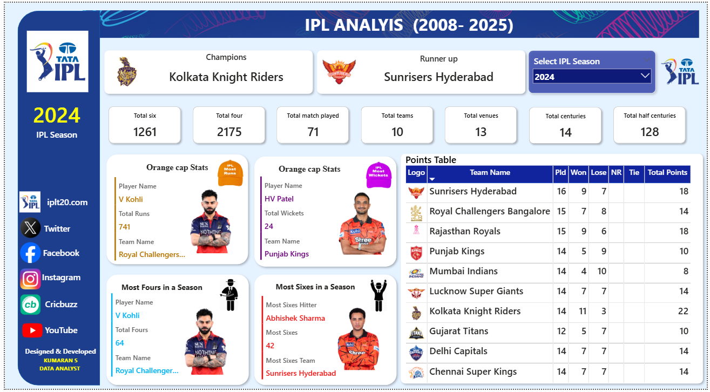

  

<h1 align="center">🏏 IPL Analysis Dashboard</h1>

An interactive Power BI dashboard that provides comprehensive insights into Indian Premier League (IPL) matches, teams, and player performances through dynamic visualizations and advanced DAX calculations.

---

## 📌 Project Overview

The **IPL Analysis Dashboard** is designed to transform raw IPL match data into meaningful insights using Power BI. It enables users to explore season-wise trends, compare team performances, analyze player statistics, and identify key tournament highlights through interactive dashboards.

---

## 🚀 Dashboard Features

- 🏆 Season-wise IPL Analysis
- 🧡 Orange Cap Holder
- 💜 Purple Cap Holder
- 💥 Most Fours Hitter
- 🚀 Most Sixes Hitter
- 📊 Team Performance Analysis
- 📈 Win Percentage Analysis
- 🏟️ Venue-wise Match Analysis
- 🎯 Toss Decision Analysis
- 📅 Season-wise Match Statistics
- 🎛️ Interactive Slicers & Filters
- ⚡ Dynamic KPI Cards

---

## 📷 Dashboard Preview

> Replace the image below with your dashboard screenshot.

  

---

## 🛠️ Tech Stack

- **Power BI**
- **DAX**
- **Power Query**
- **Excel / CSV**
- **Data Modeling**

---

## 📊 KPIs Included

- Total Matches
- Total Teams
- Total Players
- Orange Cap Holder
- Purple Cap Holder
- Most Fours
- Most Sixes
- Total Runs
- Total Wickets
- Win Percentage
- Toss Analysis

---

## 📂 Dataset

The dashboard is built using IPL historical datasets, including:

- Match Details
- Ball-by-Ball Data
- Team Information
- Player Information

---

## 🎯 Skills Demonstrated

- Data Cleaning
- Data Modeling
- Power Query (ETL)
- DAX Measures
- KPI Design
- Interactive Dashboard Development
- Data Visualization
- Business Intelligence

---

---

## 🌟 Key Insights

- Identify the Orange and Purple Cap holders for each season.
- Compare team performances across different IPL seasons.
- Analyze venue-wise winning trends.
- Discover players with the most fours and sixes.
- Explore interactive season and team filters for detailed analysis.

---

## 📬 Contact

**Kumaran S**

- 💼 LinkedIn: https://www.linkedin.com/in/kumaran-s-56222529a
- 💻 GitHub: https://github.com/kumaran1523
- 🌐 Portfolio: https://kumaran-1523-portfolio.vercel.app

---

⭐ If you found this project useful, don't forget to **Star** this repository!
